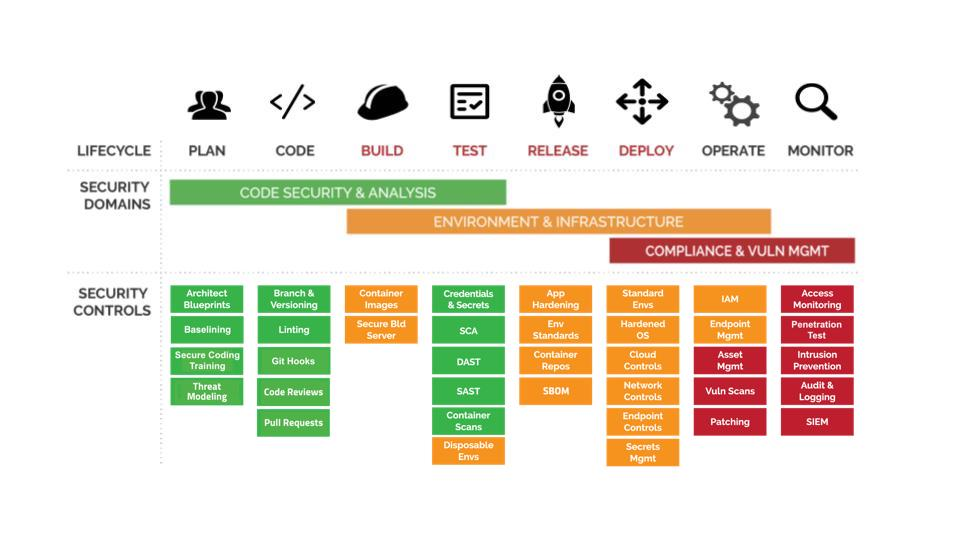

# The DevSecOps Omnibus Checklist - Version 1.0
The intent of this project is to create an actionable list of things that any org 
or team, 
of any size, can do to implement a *functioning* DevSecOps program across an estate of applications. Or put more simply: this project is meant to be a list of actionable steps that engineers can follow that will give them a better, more secure application in the net?.  And by "actionable" I mean specific things you can do on a server, in your source code or in a vendor platform that will materially influence the security of your web application. 

## Some background

I have been hardening applications environments for more than 20 years and one of my biggest frustrations is how abstract the language of compliance frameworks can be.  They are too disconnected from the actual technical things that technical people have to do to make something better.  Following compliance guidelines is really important but frameworks like the NIST Secure Software Development Framework (SSDF) talk about theoretical or often non-sensical vulnerabilities.  For example, here's a line from the SSDF section PO item 3.2: "Follow recommended security practices to deploy and maintain tools and toolchains."  Then in the implementation examples section there are 9 examples that range from evaluating tools and acquiring tools for the developer environment to collecting evidence for an audit. Like, WTF?!  How is an engineer supposed to know what to do with that?  This is often because the person or group of people writing the framework are technically aligned becasue they come from a risk or GRC < (abbrev without spelling it out) background.  We want this DevSecOps Checklist to be different. This document is for engineers!

I was inspired by the recent [MVSP](https://mvsp.dev) project which I have profound respect for.  But, the MVSP is a framework for defining what a minimally viable secure product is, and not a true checklist of "do this, now do that". This document is NOT meant to replace the MVSP in any way.  Instead this is a separate document with a separate target audience and separate philosopy.  This document, unlike the MVSP, is meant to be the pentultimate checklist for implementing a DevSecOps program at your company.  This document is meant to provide a step by step guide on how to build better software by auditing whats in place now. Finally, I'm selfish and I want a document I can use myself to quickly and efficiently secure an estate of applications.

## Shift Left

Every company and every application is different and that means that simplistic statements like "shift left" need to be clarified.  For many large companies, managers find it difficult to enforce security precautions on the developers laptop like the use of MFA or git hooks.  For this company, it is best to shift left to the CI/CD solution(s) and concentrate initially there.  For smaller startups or companies with immature or non-existant CI/CD pipelines it is easier to shift left all the way to the developers laptop.  If you can define what secure looks like at this early stage, you are saving time and money.  For other organizations, it is a combination, depending on group and maturity, and this is all perfectly fine.  The intent of this document is to provide a roadmap to DevSecOps nirvana and not to say what is the best journey to nirvana.  The journey is yours.  

This checklist is broken down into five areas of concern which will often map to different technical roles within an org:

* [Development environment](#development)  
* [Source code management](#scm)  
* [CI/CD](#cicd)  
* [Deployment](#deployment)  
* [Organization](#org)  
* [Addendum: Compliance](#compliance)  

## Priority and Difficulty explained

We use two rating systems in the checklist.  The first rating system is "Priority" and has three levels: 1, 2 and 3.  These levels are meant to impart to the developer which things they should do first, what the should do second, and which things they should do last, or third.

The second rating system is "Difficulty" and is meant to impart how hard it is to implement this control or function.  This system uses three labels "Easy", "Medium" and finally the hardest "Difficult".  

# The Checklist

<h2 id="development">The developers environment</h2>

The developers laptop is where most of the magic happens, but also where most of the problems are introduced.  If you want to shift as far left as you can this is where you want to land much of your embedded security.

| Name | Priority | Description | Difficulty | Maps to security frameworks |
| :---        | :---   | :--- | :---    | :---    |
| Secure Code Training | 2 | Implement a secure coding training program for your devs | Medium | <ul><li>CIS8</li><li>APRA234</li><li>NIST 800-53B</li><li>SSDF1.1</li></ul> |
| Source Code Versioning | 1 | Use a standard concurrent version system (CVS) like git in dev environments | Easy | <ul><li>APRA234</li><li>CIS8</li><li>ISM GSD</li><li>ISO27001</li><li>NIST 800-53B</li><li>SSDF1.1</li></ul> |
| .gitignore | 1 | Limit what can be sent to repository via a .gitignore file | Easy | <ul><li>APRA234</li><li>CIS8</li><li>NIST 800-53B</li><li>SSDF1.1</li></ul> |
| Git pre-commit hook | 2 | Utilize a pre-commit git hook to run security scans when code is commited | Easy | <ul><li>APRA234</li><li>CIS8</li><li>NIST 800-53B</li><li>SSDF1.1</li></ul> |
| Local Software Composition Analysis | 1 | Scan source code for vulnerable libraries and open source software in dev environment | Easy | <ul><li>APRA234</li><li>CIS8</li><li>ISM GSD</li><li>ISO27001</li><li>NIST 800-53B</li><li>SSDF1.1</li></ul> |
| Local Static Code Analysis | 2 | Scan source code for vulnerabilities in the source code itself in dev environment | Easy | <ul><li>APRA234</li><li>CIS8</li><li>ISM GSD</li><li>ISO27001</li><li>NIST 800-53B</li><li>SSDF1.1</li></ul> |
| Local Sensitive Data Analysis | 1 | Scan source code for secrets, credentials, API keys and similar in dev environment | Easy | <ul><li>APRA234</li><li>CIS8</li><li>ISM GSD</li><li>ISO27001</li><li>NIST 800-53B</li><li>SSDF1.1</li></ul> |
| Application Baseline | 3 | Create an application baseline | Medium | <ul><li>APRA234</li><li>CIS8</li><li>ISM GSD</li><li>NIST 800-53B</li><li>SSDF1.1</li></ul> |

<h2 id="scm">Source code management (SCM)</h2>

Most companies now store their source code in cloud based repositories like GitHub, Bitbucket or Gitlab.  Even if you don't, you will use a centralized place for your software engineers to store their code.  Centralization and versioning means that these developers can work together without (mostly) stepping on each others toes.  Joe and Molly can both be working on the same component, file or function but their changes won't necessarily break the other ones changes. SCM is also a GREAT place to deploy security functions like server side git hooks and multi-factor authentication for your developers!

| Name | Priority | Description | Difficulty | Maps to security frameworks |
| :---        | :---   | :--- | :---    | :---    |
| Source Code Management | 1 | Use a centralized source code management (SCM) system like Bitbucket, GitHub or Gitlab | Easy | <ul><li>APRA234</li><li>CIS8</li><li>ISM GSD</li><li>ISO27001</li><li>NIST 800-53B</li><li>SSDF1.1</li></ul> |
| User Roles | 1 | Create unique user and team roles so that access to source code can be tailored | Easy | <ul><li>APRA234</li><li>CIS8</li><li>ISM GSD</li><li>NIST 800-53B</li><li>SSDF1.1</li></ul> |
| SSH | 2 | Use the SSH protocol to access your repositories instead of HTTPS | Easy | <ul><li>APRA234</li><li>CIS8</li><li>ISM GSD</li><li>NIST 800-53B</li><li>SSDF1.1</li></ul> |
| Multi-Factor Authentication | 1 | Make sure all developers use multi-factor authentication (MFA) when pulling, commiting or pushing code. This is especially important if you use company email as your login for SCM
> UK: Oh boy, really? what about git over ssh or app password with limited permissions.
| Easy | <ul><li>APRA234</li><li>CIS8</li><li>ISM GSD</li><li>NIST 800-53B</li><li>SSDF1.1</li></ul> |
| Server side git hook | 3 | Utilize a server side git hook like update or post-receive hook to run automatic scans | Medium | <ul><li>APRA234</li><li>CIS8</li><li>NIST 800-53B</li><li>SSDF1.1</li></ul> |
| Developer Collaboration | 2 | Use collaboration tools to document the changes to a software application | Difficult | <ul><li>APRA234</li><li>CIS8</li><li>NIST 800-53B</li><li>SSDF1.1</li></ul> |
| Pull Requests | 1 | Enforce pull or merge requests so all code is verified by team lead or senior engineer | Easy | <ul><li>APRA234</li><li>CIS8</li><li>ISO27001</li><li>NIST 800-53B</li><li>SSDF1.1</li></ul> |
| Peer reviews | 1 | Enforce peer reviews by software engineers colleagues to increase code quality and security | Easy built-in | <ul><li>APRA234</li><li>CIS8</li><li>ISO27001</li><li>NIST 800-53B</li><li>SSDF1.1</li></ul> |

<h2 id="cicd">CI/CD Pipelines & Build Environments</h2>

Modern web applications are built using modern continuous integration and deployment processes.  This means that you run tests specific to whatever environment you are pushing to whether that's DEV, STAGING or PROD.

| Name | Priority | Description | Difficulty | Maps to security frameworks |
| :---        | :---   | :--- | :---    | :---    |
| CI/CD pipeline | 1 |Implement a CI/CD pipeline | Medium | <ul><li>APRA234</li><li>CIS8</li><li>ISM GSD</li><li>ISO27001</li><li>SSDF1.1</li></ul> |
| Application Environments | 2 | Create separate environments for dev, staging and prod, and treat each as independent with its own data, testing and requirements | Medium | <ul><li>CIS8</li><li>ISM GSD</li><li>ISO27001</li><li>SSDF1.1</li></ul> |
| Application Data Separation | 3 | Make sure that dev and test environments are **not** using the same data as production. If the use of live data is required then make sure that data is anonymized. | Difficult | <ul><li>CIS8</li><li>ISM GSD</li><li>ISO27001</li><li>SSDF1.1</li></ul> |
| CI/CD Administration | 3 | Create and enforce user or team roles so that only the appropriate people can change or disable tests and deployment requirements | Medium | <ul><li>CIS8</li><li>ISM GSD</li><li>ISO27001</li><li>SSDF1.1</li></ul> |
| Credential Store | 1 | Create a secure encrypted place to store senstive credentials like passwords, API keys, etc. | Medium | <ul><li>APRA234</li><li>CIS8</li><li>ISM GSD</li><li>NIST 800-53.2b</li><li>SSDF1.1</li></ul> |
| Centralized Software Composition Analysis | 1 | Scan source code for vulnerable libraries and open source software from within a CD stage | Easy | <ul><li>APRA234</li><li>CIS8</li><li>ISM GSD</li><li>ISO27001</li><li>NIST 800-53.2a</li><li>SSDF1.1</li></ul> |
| Centralized Static Code Analysis | 2 | Scan source code for vulnerabilities in the source code itself from within a CD stage | Easy | <ul><li>APRA234</li><li>CIS8</li><li>ISM GSD</li><li>ISO27001</li><li>NIST 800-53.2b</li><li>SSDF1.1</li></ul> |
| Centralized Sensitive Data Analysis | 2 | Scan source code for secrets, credentials, API keys and similar from within a CD stage | Easy | <ul><li>APRA234</li><li>CIS8</li><li>ISM GSD</li><li>ISO27001</li><li>NIST 800-53B</li><li>SSDF1.1</li></ul> |
| DAST | 3 | Scan running application for vulnerabilities | Medium | <ul><li>CIS8</li><li>ISM GSD</li><li>ISO27001</li><li>NIST 800-53B</li><li>NIST 800-53B</li><li>SSDF1.1</li></ul> |

<h2 id="deployment">Deployment</h2>

Applications are deployed somewhere whether thats an AWS Lambda, S3 bucket or some old crusty server in the corner of the server room.  In any case, DevSecOps best practices mean that you need to include that deployment location in your processes.  

| Name | Priority | Description | Difficulty | Maps to security frameworks |
| :---        | :---   | :--- | :---    | :---    |
| Valid SSL Certificate | 1 | Create and use a valid SSL certificate for each application URL, or implement a wildcard cert | Easy | <ul><li>APRA234</li><li>CIS8</li><li>ISM GSD</li><li>ISO27001</li><li>NIST 800-53B</li><li>SSDF1.1</li></ul> |
| Encrypt Traffic | 1 | Encrypt all traffic that's public facing | Medium | <ul><li>APRA234</li><li>CIS8</li><li>CIS8</li><li>ISM GSD</li><li>ISO27001</li><li>NIST 800-53B</li><li>SSDF1.1</li></ul> |
| Redirect to HTTPS | 1 | Configure web service to redirect all inbound requests to port 80 to the secure HTTPS endpoint | Easy | <ul><li>CIS8</li><li>ISM GSD</li><li>ISO27001</li><li>NIST 800-53B</li><li>SSDF1.1</li></ul> |
| HSTS | 1 | Enable HSTS in your webserver, load balancer or CDN | Easy | <ul><li>CIS8</li><li>ISM GSD</li><li>ISO27001</li><li>NIST 800-53B</li><li>SSDF1.1</li></ul> |
| CSP | 1 | Enable content security policy (CSP) in the webserver, load balancer or CDN | Easy | <ul><li>CIS8</li><li>ISM GSD</li><li>ISO27001<li>NIST 800-53B</li></ul> |
| Use Current Software | 1 | Use the most recent versions of application components, languages, frameworks and operating systems | Difficult | <ul><li>CIS8</li><li>ISM GSD</li><li>ISO27001<li>SSDF1.1</li></ul> |
| Alternative Deployment | 3 | Have tested and working altnerative way to deploy changes to your applicaiton other than using your standard process with GitHub or Bitbucket in case they go down. This must include the ability to push to PROD from local in emergencies. | Difficult | <ul><li>CIS8</li><li>NIST 800-53B</li><li>SSDF1.1</li></ul> |
| security.txt | 1 | Create a security.txt file in the root of your application so people know how to contact you about security issues | Easy | <ul><li>CIS8</li><li>ISM GSD</li><li>SSDF1.1</li></ul> |
| X-Forwarded-By | 2 | Configure your webservers, load balancers & web proxies to include the X-Forwarded-By: header | Easy | <ul><li>APRA234 ATM D-2-d-i</li><li>CIS8</li><li>NIST 800</li></ul> |
| Logging | 1 | Collect application logs in realtime and send to centralized storage or SIEM | Medium | <ul><li>CIS8 16.11</li><li>APRA234</li><li>ISM GSM</li><li>NIST 800</li><li>SSDF1.1</li></ul> |
| WAF | 2 | Implement a web application firewall (WAF) to protect your application from known attacks | Medium | <ul><li>APRA234</li><li>CIS8</li><li>NIST 800-53.2a</li></ul> |
| CDN | 3 | Use a content delivery network (CDN) whenever possible to add availability and security to you applications | Medium | <ul><li>APRA234</li><li>CIS8</li><li>ISM GN</li><li>NIST 800-53.2a</li></ul> |
| Harden Operating System | 2 | Harden operating system using industry best practices from CIS, ISM, etc | Difficult | <ul><li>CIS8</li><li>ISM GSM</li><li>ISM GOSH</li><li>SSDF1.1</li></ul> |
| Encrypt Storage | 3 | Encrypt all filesystems, disks and cloud storage | Medium | <ul><li>CIS8</li><li>NIST 800-50b</li><li>SSDF1.1</li></ul> |
| SBOM | 3 | Generate a **real-time** software bill-of-materials (SBOM) | Medium | <ul><li>CIS8</li><li>ISM GSD</li><li>NIST 800-53B</li><li>SSDF1.1</li></ul> |
| Monitor Application | 1 | Monitor your application in real-time so you know when its state changes for the worse (or better). This includes uptime, performance and security monitoring | Medium | <ul><li>CIS8</li><li>NIST 800-53B</li><li>SSDF1.1</li></ul> |

<h2 id="org">Organization</h2>

People don't deploy applications, organizations do.  Some steps in the DevSecOps checklist need to be owned by the Organization itself.  

| Name | Priority | Description | Difficulty | Maps to security frameworks |
| :---        | :---   | :--- | :---    | :---    |
| Penetration Testing | 1 | Have your application pentested regularly | Medium | <ul><li>CIS8</li><li>ISM GSD</li><li>NIST 800-53B</li><li>SSDF1.1</li></ul> |
| Threat Modeling | 2 |  Build a collaborative way for developers and security staff to understand the threat landscape for an individual application | Medium | <ul><li>CIS8</li><li>ISM GSD</li><li>NIST 800-53B</li><li>SSDF1.1</li></ul> |
| SIEM | 2 | Implement a SIEM and send all application, system and cloud logs to it | Medium | <ul><li>CIS8</li><li>NIST 800-53B</li><li>SSDF1.1</li></ul> |
| Attack Surface Management | 1 | Identify public facing resources via automation | Medium | <ul><li>CIS8</li><li>CIS8</li><li>NIST 800-53B</li><li>SSDF1.1</li></ul> |
| Sovereignty | 1 | Require that all code is written in, stored in, or otherwise served from a location and/or sovereignty that aligns with orgs requirements | Medium | <ul><li>ISM GCSR</li><li>ISO27001</li></ul> |
| Vulnerability Disclosure | 1 | Create and publish a set of procedures to let people contact you when they find security issues in your app | Easy | <ul><li>CIS8</li><li>ISM GSD</li><li>SSDF1.1</li></ul> |
| Bug Bounty | 3 | Setup a bug bounty program to incentivize security researchers to tell you about vulnerabilities they find | Medium | <ul><li>CIS8</li><li>ISM GSD</li><li>NIST 800-53B</li><li>SSDF1.1</li></ul> |
>>>>>>> dev

<h2 id="compliance">Compliance - Security Framework Reference Material</h2> 

Because this is meant to be a manifesto about how to do DevSecOps, we have to be cognizant that there are three groups of people that this affects: Developers, Operations and InfoSec.  Historically, there are many compliance frameworks that address the InfoSec community and to a lessor extent Operations teams.  But software development was never mentioned until only recently.  Understanding this, I wanted to note there are only really 3 frameworks that address the software development part of DevSecOps:

* NIST 800 SA 10, 11, 15, 16 and 17
* CIS Section 16
* Australian ISM "Guidelines for Secure Development"

Below you will find links to several security frameworks that align with this document.  I have personally spent many years implementing CIS controls into my application environments.  CIS is a wonderful framework as its very presciptive and easy for an engineer to understand.  This is not to say that CIS controls are easy to implement.  They are not!  Regardless, you can't deny the ubiquity of ISO27001 and SOC2 and I want this document to help orgs looking to meet those requirements as well.  In fact, SecureStack has started a SOC2 program and in parallel to writing this document I am busily mapping SOC2 requirements and will eventually add them to this document.  

I had a number of Australian friends suggest that I tackle the Australian ISM and APRA CPS 234 as well so you will see me attempt to map it as well when it makes sense.  This is a work in progress and I encourage anyone that is interested to jump in and suggest mappings.  You can add an issue in GitHub or simply create a PR.  

### NIST 800
NIST 800-218 "Secure Software Development Framework" (SSDF) version 1.1: https://csrc.nist.gov/publications/detail/sp/800-218/draft  

NIST 800-53B (2021): https://csrc.nist.gov/publications/detail/sp/800-53b/final   
Control Families via HTML: https://csrc.nist.gov/projects/risk-management/sp800-53-controls/release-search#!/families?version=5.1

1. [SA-11: Developer Testing and Evaluation](https://csrc.nist.gov/projects/risk-management/sp800-53-controls/release-search#!/control?version=5.1&number=SA-11)   
2. [SA-15: Development Process, Standards, and Tools](https://csrc.nist.gov/projects/risk-management/sp800-53-controls/release-search#!/control?version=5.1&number=SA-15)  
3. [SA-16: Developer-Provided Training](https://csrc.nist.gov/projects/risk-management/sp800-53-controls/release-search#!/control?version=5.1&number=SA-16) 
4. [SA-17: Developer Security and Privacy Architecture and Design](https://csrc.nist.gov/projects/risk-management/sp800-53-controls/release-search#!/control?version=5.1&number=SA-17)  

NIST 800-92: https://nvlpubs.nist.gov/nistpubs/Legacy/SP/nistspecialpublication800-92.pdf   
NIST 800-95: Guide to Secure Web Services (2007): https://nvlpubs.nist.gov/nistpubs/Legacy/SP/nistspecialpublication800-95.pdf   

### CIS Critical Security Control 16: Application Software Security
The Center for Internet Security is an organization that has been providing very prescriptive security controls since 2000. There are a total of 18 security control groups with section 16 being the group we will be referencing for this document.  
https://www.cisecurity.org/controls/application-software-security

It's not the focus of this document, but CIS maintains an amazing set of benchmarks and build playbooks for most operating sytems.  I have been using these templates for years and they are a great resource:  https://www.cisecurity.org/cis-benchmarks/

### Australian ISM 
The Australian Cyber Security Centre has authored a document called the "Information Security Manual" or ISM as its commonly called.  The landing page for this document is https://www.cyber.gov.au/sites/default/files/2021-12/Information%20Security%20Manual%20%28December%202021%29.pdf.  

This document is large and has a very broad scope.  You can download the complete ISM at https://www.cyber.gov.au/sites/default/files/2021-12/Information%20Security%20Manual%20%28December%202021%29.pdf

In late 2021 the ACSC released the "Guidelines for Software Development" (GSD).  These are a general set of guidelines for embedding secure coding practices into an organization. These guidelines are far from authoratative and are not very presciptive with my favorite snippet from the GSD being this little gem: "Platform-specific secure programming practices are used when developing software, including using the lowest privilege needed to achieve a task, checking return values of all system calls, validating all inputs and encrypting all communications."  Is that a catch all or what?!  Wow!  Regardless, I am respectful of the energy that went into this set of guidelines and will continue to try and bring visibility to it as much as I personally can.  

You can find the GSD here:  https://www.cyber.gov.au/acsc/view-all-content/advice/guidelines-software-development  

### APRA CPG 234
The Australian Prudential Regulation Authority (APRA) is part of the Australian government and is charged with regulating the financial industry. It published the "Prudential Standard CPS 234" document in 2019 which outlines high level information security requirements. 

This document is organized in an unusual way with 8 "attachments" at the end of the doc.  It is in these attachments that the security controls and expectations are laid out. You can find the APRA 234 document at https://www.apra.gov.au/sites/default/files/cpg_234_information_security_june_2019_0.pdf.   

## What's been mapped so far?

- [x] mapped all of ISM GSD
- [x] mapped all of SSDF
- [x] mapped CIS section 16

## What's left to do?

- [ ] map remaining ISO 27001 Annex 14
- [ ] map CIS section other than 16 to all items
- [ ] map remaining NIST 800-53
- [ ] map remaining ISM infrastructure
